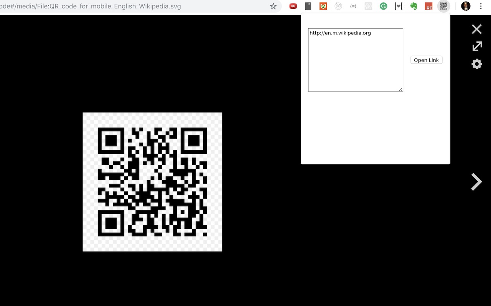

# Chrome QR Code Reader
A chrome extension for reading QR code from webpage.
It uses [zxing-js/library](https://github.com/zxing-js/library) for decoding QR Code.

## Installation

Get it from chrome web store: [QR Code Reader](https://chrome.google.com/webstore/detail/qr-code-reader/likadllkkidlligfcdhfnnbkjigdkmci)

## Usage
- Click extension icon or use `Command/Ctrl+Shift+S` shortcut to read QR code on current tab.
- You can customize extension shortcut On `chrome://extensions/shortcuts` page.

## Known Issues
- Can't read multiple QR codes in one page.
- Unable to decode some QR code

